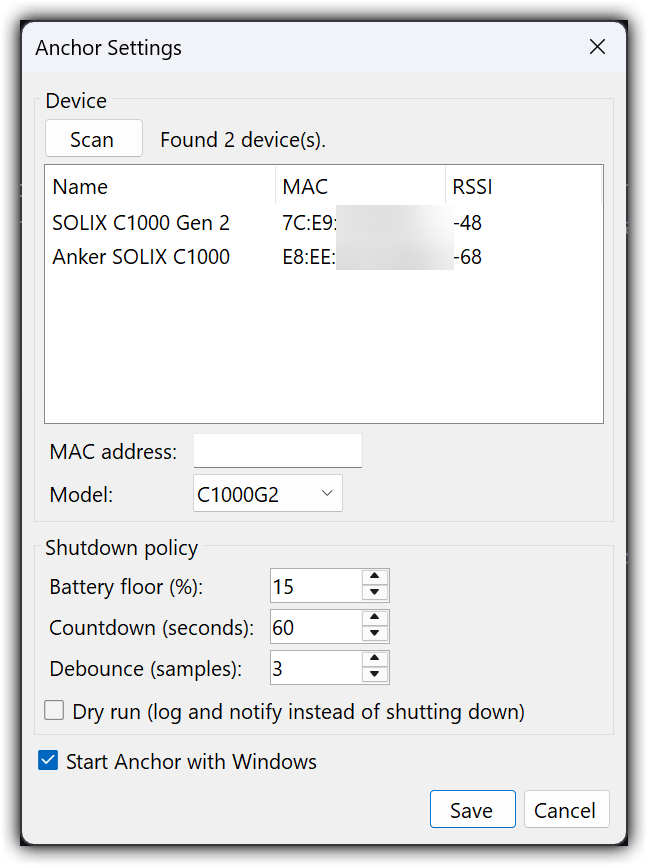
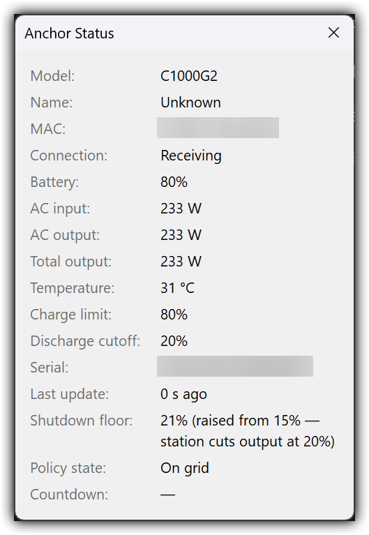

# Anchor

Anchor turns an Anker Solix portable power station into a UPS for a Windows PC. It runs as a
system-tray application, monitors the power station over Bluetooth Low Energy, and gracefully
shuts Windows down when wall power is lost and the station's battery drains to a floor you choose.

Think of it as PowerChute for an Anker Solix: no data cable, no separate UPS box — the power station
you already run your PC from becomes the battery backup, and Anchor handles the orderly shutdown.

## Screenshots





## How it works

Anchor polls the power station's telemetry over BLE and watches two things: whether AC input
(wall power) is present, and the battery percentage.

- **On battery + at/below the floor.** When AC input drops to zero and the battery falls to the
  configured floor, Anchor starts a shutdown countdown.
- **Debounce.** A transient reading won't trigger anything. The trip condition must hold for a
  configurable number of consecutive samples before the countdown begins, filtering out momentary
  dropouts and BLE noise.
- **Countdown + cancel.** A visible countdown gives you a window to intervene. If wall power returns
  or the battery recovers above the floor during the countdown, the shutdown is cancelled
  automatically.
- **Dry-run mode.** With `dryRun` enabled, Anchor runs the full detection and countdown logic but
  logs the shutdown instead of executing it — useful for confirming your thresholds behave before you
  trust it with a real shutdown.

## Supported models

Support is limited to Solix models that expose the BLE telemetry Anchor needs for UPS-style
monitoring (battery level and AC input state).

| Model          | Status                                                              |
| -------------- | ------------------------------------------------------------------ |
| C1000 / C1000X | **Supported — hardware-verified** (full negotiation + telemetry)   |
| C1000 Gen 2    | **Supported — hardware-verified** (incl. charge/discharge limits)  |
| C300           | Supported (protocol port; not hardware-verified)                   |
| C800           | Supported (protocol port; not hardware-verified)                   |
| F2000          | Supported (protocol port; not hardware-verified)                   |
| F3800          | Supported (protocol port; not hardware-verified)                   |

Other Anker Solix devices (Solarbank series, PowerCore/prime chargers and power banks, and similar)
are intentionally unsupported: they either don't expose the telemetry required or aren't a sensible
fit for PC UPS duty.

### C1000 Gen 2 on Windows — negotiation resume

The Gen 2 has a Windows-specific quirk: it accepts the first encryption-negotiation write, advances its
internal state, then drops the BLE link *before* replying — over the Windows (WinRT) BLE stack only.
Anchor handles this transparently: after the stage-0 drop it reconnects and resumes negotiation at
stage 1, then completes the encrypted session normally. This is fully automatic and hardware-verified.

## Install

1. Download the latest `Anchor-<version>-setup.exe` and run it. The installer requires
   administrator rights so it can install to Program Files.
2. **SmartScreen warning.** The installer and the app are **not code-signed**, so Windows SmartScreen
   will likely show a "Windows protected your PC" prompt. Click **More info → Run anyway** to proceed.
3. On first launch Anchor registers itself to start automatically at login (toggle it any time in
   **Settings → Start Anchor with Windows**), and can be launched immediately when setup finishes.

Your Bluetooth adapter must support BLE, and the PC must be within Bluetooth range of the power
station.

## First-run setup

1. Open Anchor from the system-tray icon and choose **Settings**.
2. Click **Scan** to discover nearby Solix devices over BLE.
3. Pick your device from the list and select its **model** from the supported list above.
4. Set the **battery floor** — the percentage at which, while on battery, Anchor should begin the
   shutdown countdown.
5. Save. Anchor connects and begins monitoring. Leave `dryRun` on for the first power-loss test if
   you want to confirm behavior without an actual shutdown.

## Configuration reference

Settings are stored in `config.json` under `%APPDATA%\Anchor`. The tray Settings dialog writes this
file; you can also edit it directly (restart the app after editing).

| Key                  | Type    | Default | Description                                                                 |
| -------------------- | ------- | ------- | --------------------------------------------------------------------------- |
| `deviceMac`          | string  | —       | BLE MAC address of the power station, e.g. `AA:BB:CC:DD:EE:FF`.             |
| `deviceModel`        | string  | `C1000` | One of the supported models (e.g. `C1000`, `C1000G2`, `C300`, `C800`, `F2000`, `F3800`); unknown values fall back to `C1000`. |
| `batteryFloorPercent`| integer | `15`    | Battery % at/below which, on battery, the shutdown countdown starts.        |
| `debounceSamples`    | integer | `3`     | Consecutive samples the trip condition must hold before triggering.         |
| `countdownSeconds`   | integer | `60`    | Length of the shutdown countdown, during which recovery cancels shutdown.   |
| `dryRun`             | boolean | `false` | When true, log the shutdown instead of executing it.                        |

The uninstaller leaves `%APPDATA%\Anchor` in place, so your configuration survives reinstalls.

## Updates

Anchor checks GitHub Releases for a newer version on startup. When an update is available it shows a
tray notification and an **Update available...** menu item that downloads and launches the new installer.
You can also check on demand from the tray menu (**Check for updates…**).

## Building from source

Requirements:

- .NET 10 SDK
- PowerShell 7
- [Inno Setup 6](https://jrsoftware.org/isdl.php) (for building the installer)

From the repository root:

```powershell
pwsh scripts\build-installer.ps1
```

The script publishes the tray app as a self-contained single-file `win-x64` executable into
`artifacts\publish`, locates `ISCC.exe`, and compiles `installer\anchor.iss` into
`artifacts\installer`.

To just build/run the app during development:

```powershell
dotnet build
dotnet run --project src\AnchorTray
```

## Troubleshooting

### Scanning finds nothing

- **Press the Bluetooth/connection (IoT) button on the station.** Setting the station up over
  Wi-Fi disables its Bluetooth entirely — Wi-Fi and BLE are mutually exclusive on these stations —
  and stations also stop advertising after being disconnected for a while. Pressing the button
  re-enables BLE advertising; if that doesn't help, power-cycle the station.
- Keep the station within roughly 10 m of the PC's Bluetooth adapter.
- Close the Anker mobile app. The stations accept only one BLE connection at a time, so a phone
  holding the connection makes the station invisible to Anchor.

### Running without installing

Run the tray app straight from source:

```powershell
dotnet run --project src/AnchorTray
```

Exit any installed tray instance first — a single-instance mutex prevents a second copy from
starting. Pass `-- --verbose` to also write BLE debug messages (per-packet detail) to the log;
logs are at `%APPDATA%\Anchor\logs\anchor.log`.

For low-level BLE debugging without the tray app, use the console tool:

```powershell
dotnet run --project tools/SolixConsole
```

scans for nearby Solix devices; add `<MAC> <model>` to connect and stream telemetry. Additional
diagnostic flags: `-v`/`--verbose` (protocol logging), `--gatt` (dump the device's GATT table),
`--pair`/`--unpair` (BLE pairing experiments), `--no-maintain` (disable the connection keepalive),
`--delay <ms>` (settle before the first handshake write).

### C1000 Gen 2 charge/discharge limits

The C1000 Gen 2 reports its user-set charge and discharge limits in telemetry. These are
**read-only** over BLE — the protocol has no known command to change them, so set them in the
Anker app. Anchor uses the reported discharge limit defensively: if the station's own discharge
cutoff is at or above your configured battery floor, the station would cut output before the
shutdown countdown ever fired and the PC would die hard. Anchor then raises the effective shutdown
floor just above the station's cutoff and shows it in the Status window; a floor already above the
cutoff is left exactly as you set it.

## Trademark and affiliation

Anchor is an **unofficial**, independent project. It is **not affiliated with, authorized by, or
endorsed by Anker Innovations**. "Anker" and "Solix" are trademarks of their respective owners and
are used here only to describe compatibility.

## Attribution and license

Anchor is licensed under the [MIT License](LICENSE).

BLE communication is handled by `src/SolixBle`, a C# port of
[flip-dots/SolixBLE](https://github.com/flip-dots/SolixBLE) (MIT). See
[THIRD-PARTY-NOTICES.md](THIRD-PARTY-NOTICES.md) for the upstream license text.
